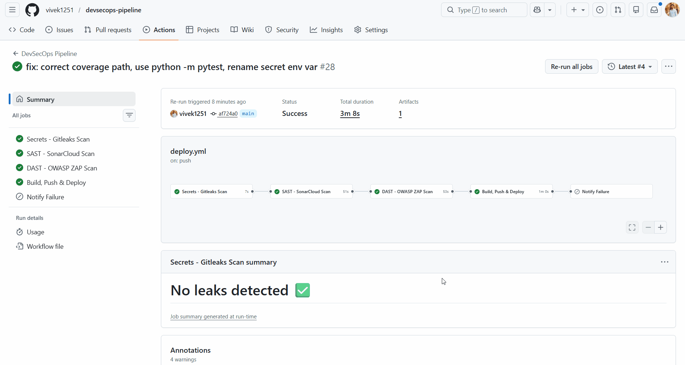
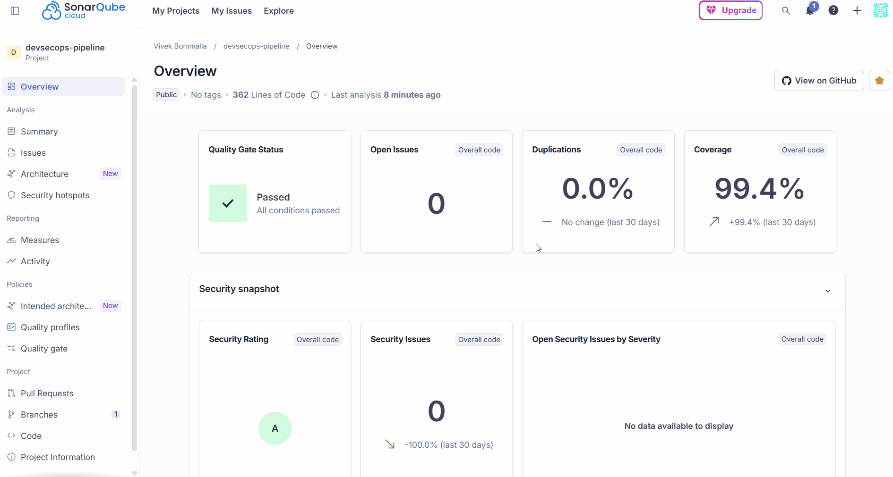
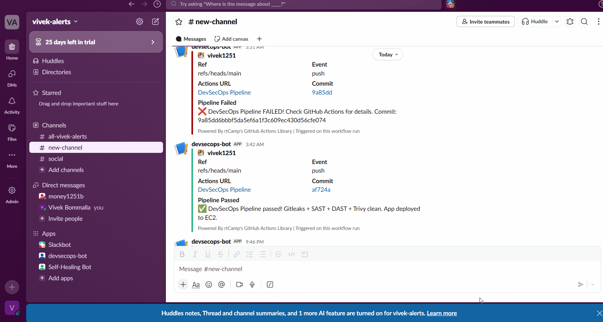

# 🔐 DevSecOps Pipeline

<div align="center">


> **A fully automated CI/CD pipeline with security baked in at every stage — secrets scanning, SAST, DAST, container scanning, deployment, and real-time Slack alerts.**

</div>

---

## 📋 Table of Contents

- [Overview](#-overview)
- [Pipeline in Action](#-pipeline-in-action)
- [Architecture](#-architecture)
- [Pipeline Stages](#-pipeline-stages)
- [Security Tools](#-security-tools)
- [Project Structure](#-project-structure)
- [Setup & Installation](#-setup--installation)
- [Slack Notifications](#-slack-notifications)
- [Contributing](#-contributing)

---

## 🌟 Overview

This project implements a **DevSecOps CI/CD pipeline** that integrates security scanning seamlessly into the software delivery lifecycle. Security is not an afterthought — it is embedded at every stage of the pipeline.

Every push to the repository automatically triggers:

- 🔑 **Secrets scanning** — Gitleaks detects any leaked credentials
- 🔍 **SAST** — SonarCloud performs deep static code analysis
- 🌐 **DAST** — OWASP ZAP scans for runtime vulnerabilities
- 🐳 **Build, Push & Deploy** — Docker image built, scanned with Trivy, deployed to EC2
- 📣 **Slack alerts** — Real-time pass/fail notifications to your team

---

## 🎬 Pipeline in Action

### ✅ GitHub Actions — Full Pipeline Run (Success)

> All 4 stages passed in **3m 8s** — Gitleaks ✅ · SonarCloud ✅ · OWASP ZAP ✅ · Build & Deploy ✅



---

### 🔍 SonarCloud — Code Quality & Security Results

> Quality Gate: **Passed** · Open Issues: **0** · Duplications: **0.0%** · Coverage: **99.4%** · Security Rating: **A**



---

### 📣 Slack — Real-Time Pipeline Alerts

> The `devsecops-bot` sends instant Slack notifications on every pipeline run — success or failure — with commit info and direct links.



---

## 🏗️ Architecture

```
Developer Push
      │
      ▼
┌──────────────────────────────────────────────────────────────┐
│                    GitHub Actions CI/CD                      │
│                                                              │
│  ┌───────────┐  ┌───────────┐  ┌──────────┐  ┌──────────┐  │
│  │ Gitleaks  │─▶│SonarCloud │─▶│OWASP ZAP │─▶│  Build   │  │
│  │  Secrets  │  │   SAST    │  │   DAST   │  │Push&Deploy│  │
│  └───────────┘  └───────────┘  └──────────┘  └──────────┘  │
│                                                    │         │
│                                          ┌─────────▼───────┐ │
│                                          │  Slack Alerts   │ │
│                                          └─────────────────┘ │
└──────────────────────────────────────────────────────────────┘
                              │
                              ▼
                        AWS EC2 Deploy
```

---

## 🚀 Pipeline Stages

### 1. 🔑 Secrets — Gitleaks Scan
Scans the entire git history for leaked API keys, passwords, tokens, or credentials before any code runs.

```yaml
- name: Run Gitleaks
  uses: gitleaks/gitleaks-action@v2
```
> Result: **No leaks detected** ✅

---

### 2. 🔍 SAST — SonarCloud Scan
Performs deep static analysis of the Python codebase — catching bugs, security hotspots, and code smells.

- Quality Gate: **Passed**
- Security Issues: **0**
- Code Coverage: **99.4%**
- Security Rating: **A**

```yaml
- name: SonarCloud Scan
  uses: SonarSource/sonarcloud-github-action@master
```

---

### 3. 🌐 DAST — OWASP ZAP Scan
Dynamically tests the running application for vulnerabilities like XSS, SQL injection, and misconfigurations.

```yaml
- name: OWASP ZAP Scan
  uses: zaproxy/action-baseline@v0.10.0
```

---

### 4. 🐳 Build, Push & Deploy
Builds the Docker image, scans it with **Trivy** for CVEs, pushes to Docker Hub, and deploys to **AWS EC2**.

```bash
docker build -t devsecops-app .
trivy image devsecops-app
docker push vivek1251/devsecops-app
ssh ec2-user@<EC2_IP> "docker pull && docker run ..."
```

---

## 🛡️ Security Tools

| Tool | Type | Purpose | Stage |
|------|------|---------|-------|
| **Gitleaks** | Secrets Scan | Detects leaked credentials in git history | Pre-build |
| **SonarCloud** | SAST | Static code quality & security analysis | Pre-build |
| **OWASP ZAP** | DAST | Dynamic runtime vulnerability testing | Post-deploy |
| **Trivy** | Container Scan | Docker image CVE scanning | Post-build |
| **Slack Bot** | Alerting | Real-time pass/fail notifications | All stages |

---

## 📁 Project Structure

```
devsecops-pipeline/
├── .github/
│   └── workflows/
│       └── deploy.yml              # Main CI/CD pipeline
├── app/
│   ├── app.py                      # Python Flask application
│   ├── test_app.py                 # Unit tests (99.4% coverage)
│   ├── Dockerfile                  # Container definition
│   └── requirements.txt            # Python dependencies
├── sonar-project.properties        # SonarCloud configuration
└── README.md
```

---

## ⚙️ Setup & Installation

### Prerequisites

- Python 3.x
- Docker
- GitHub account
- SonarCloud account
- AWS EC2 instance
- Slack workspace

### Local Setup

```bash
# 1. Clone the repository
git clone https://github.com/vivek1251/devsecops-pipeline.git
cd devsecops-pipeline

# 2. Install dependencies
pip install -r app/requirements.txt

# 3. Run tests
pytest app/ --cov=app

# 4. Build Docker image
docker build -t devsecops-app ./app

# 5. Scan with Trivy
trivy image devsecops-app
```

### GitHub Secrets Required

Set these in **Settings → Secrets → Actions**:

| Secret | Description |
|--------|-------------|
| `SONAR_TOKEN` | SonarCloud authentication token |
| `DOCKER_USERNAME` | Docker Hub username |
| `DOCKER_PASSWORD` | Docker Hub password |
| `EC2_HOST` | AWS EC2 public IP |
| `EC2_SSH_KEY` | EC2 private SSH key |
| `SLACK_WEBHOOK_URL` | Slack incoming webhook URL |

---

## 📣 Slack Notifications

The pipeline sends real-time Slack alerts via `devsecops-bot` to the `#new-channel` workspace:

- ❌ **Pipeline Failed** — Notifies on failure with commit SHA and Actions URL
- ✅ **Pipeline Passed** — Confirms all scans passed and app is deployed to EC2

---

## 🤝 Contributing

1. Fork the repository
2. Create a feature branch: `git checkout -b feature/your-feature`
3. Commit your changes: `git commit -m 'feat: add your feature'`
4. Push to the branch: `git push origin feature/your-feature`
5. Open a Pull Request into `main`

---

<div align="center">

Made with ❤️ by [vivek1251](https://github.com/vivek1251)


</div>
test

